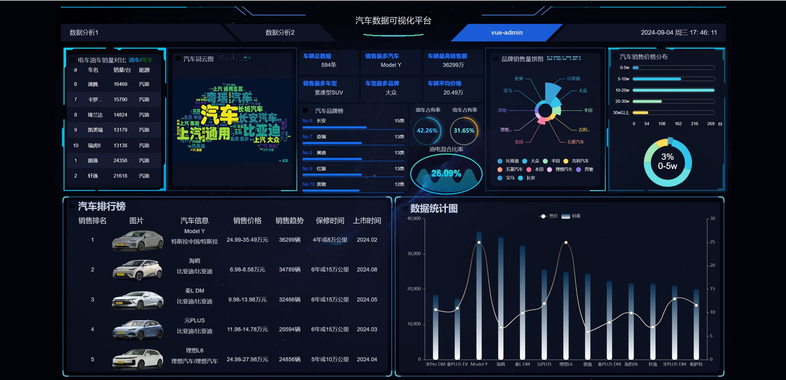

<<<<<<< HEAD
# big-screen-cardata

### 车辆数据可视化大屏：[视频链接](https://www.bilibili.com/video/BV1Ne411d7X3?p=1)

:rocket: 最终效果图如下：



:rocket:环境安装：

```sh
# 前端环境：node=12.16.1
# 如果出问题，一般是vue版本的问题，按照报错的提示安装就行
cd big-screen-vue-datav
npm install
# 后端环境安装：python=3.8 django=4.2.15
pip install -r requirements.txt -i https://pypi.tuna.tsinghua.edu.cn/simple
# 数据库是MySQL，自行百度安装就行，此外python环境还需安装mysqlclient
pip install mysqlclient
```

=======
# big-screen-cardata

### 车辆数据可视化大屏：[视频链接](https://www.bilibili.com/video/BV1Ne411d7X3?p=1)

:rocket: 最终效果图如下：


:rocket:环境安装：

```sh
# 前端环境：node=12.16.1
# 如果出问题，一般是vue版本的问题，按照报错的提示安装就行
cd big-screen-vue-datav
npm install
# 后端环境安装：python=3.8 django=4.2.15
pip install -r requirements.txt -i https://pypi.tuna.tsinghua.edu.cn/simple
# 数据库是MySQL，自行百度安装就行，此外python环境还需安装mysqlclient
pip install mysqlclient
```

>>>>>>> 30d168b195451782d26817a6cb16bb1583c6fe9a
### :rocket: 如果觉得有帮助，请给一个:star: